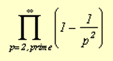
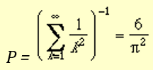

# Estimating Pi Using Various PRNGs and Searching Analysis for Heuristic PRNGs and CSPRNGs

Ernesto Cesaro's Theorem can be used to statistically approximate the value of Pi. Cesaro's theorem states that given two random integers, x and y, the probability that gcd(x, y) = 1 is 6/(Pi^2). Using a pseudo random number generator provided in various system libraries, we can generate a statistical estimate of Pi. Note that the PRNG used affects how close the resulting estimate is to Pi (3.14159).

Proof
First of all, fix an integer n, as in the second formulation of the theorem.
We are going to make a little of enumeration by counting the number of couples (i, j) where i and j are inferior to n and prime between them...

1. First condition that they are prime between them is that they are not both multiple of 2. As a number out of two is multiple of 2 , the probability that i and j are divisible by 2 is 1/2*1/2=1/2 2 .
So the probability that i and j are not multiple of 2 is (1-1/2 2).

2. Second condition is that i and j are not both multiple of 3. As well as previously, this probability is equal to (1-1/3 2).
As these conditions are independent, the probability that i and j are neither multiple of 2 nor 3 is (1-1/22)(1-1/32).
Now i and j will be prime between them if they are not both multiple of any integer, that is to say any prime number both, because any number is decomposable into first factors. By continuing for all the prime numbers the previous conditions, we obtain that probability Pthat i and j are prime between them is equal to, when n tends to the infinity: 

 
This means that looked probability is :

## Introduction to Randomness and Random Number Generator

A random bit sequence could be interpreted as the result of the flips of an unbiased “fair” coin with sides that are labeled “0” and “1,” with each flip having a probability of exactly ½ of producing a “0” or “1.” Furthermore, the flips are independent of each other: the result of any previous coin flip does not affect future coin flips. The unbiased “fair” coin is thus the perfect random bit stream generator, since the “0” and “1” values will be randomly distributed (and [0,1] uniformly distributed). All elements of the sequence are generated independently of each other, and the value of the next element in the sequence cannot be predicted, regardless of how many elements have already been produced. 

Obviously, the use of unbiased coins for cryptographic purposes is impractical. Nonetheless, the hypothetical output of such an idealized generator of a true random sequence serves as a benchmark for the evaluation of random and pseudorandom number generators.

## Random Numbers

Random numbers are a primitive element not only to cryptographers, but Computer Scientist and Programmers in general. What is desired is a method which produces a pseudo random stream of numbers fast which are cryptographically secure. However, the goals are diametrically opposed - pseudo random sequences can be produced quickly, or can be produced strongly; but usually not quickly with properties which resist Cryptanalysis.

## Pseudo-Random Number Generators (PRNGs)

As the word ‘pseudo’ suggests, pseudo-random numbers are not random in the way you might expect, at least not if you're used to dice rolls or lottery tickets. Essentially, PRNGs are algorithms that use mathematical formulae or simply precalculated tables to produce sequences of numbers that appear random. 

## True Random Number Generators (TRNGs)

In comparison with PRNGs, TRNGs extract randomness from physical phenomena and introduce it into a computer. You can imagine this as a die connected to a computer, but typically people use a physical phenomenon that is easier to connect to a computer than a die is. The physical phenomenon can be very simple, like the little variations in somebody's mouse movements or in the amount of time between keystrokes. 
