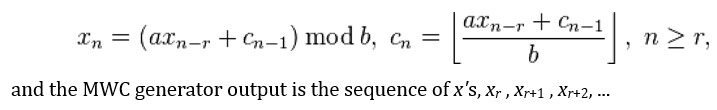

# Estimating Pi Using Various PRNGs and Searching Analysis for Heuristic PRNGs and CSPRNGs

Ernesto Cesaro's Theorem can be used to statistically approximate the value of Pi. Cesaro's theorem states that given two random integers, x and y, the probability that gcd(x, y) = 1 is 6/(Pi^2). Using a pseudo random number generator provided in various system libraries, we can generate a statistical estimate of Pi. Note that the PRNG used affects how close the resulting estimate is to Pi (3.14159).

Proof
First of all, fix an integer n, as in the second formulation of the theorem.
We are going to make a little of enumeration by counting the number of couples (i, j) where i and j are inferior to n and prime between them...

1. First condition that they are prime between them is that they are not both multiple of 2. As a number out of two is multiple of 2 , the probability that i and j are divisible by 2 is 1/2*1/2=1/2 2 .
So the probability that i and j are not multiple of 2 is (1-1/2 2).

2. Second condition is that i and j are not both multiple of 3. As well as previously, this probability is equal to (1-1/3 2).
As these conditions are independent, the probability that i and j are neither multiple of 2 nor 3 is (1-1/22)(1-1/32).
Now i and j will be prime between them if they are not both multiple of any integer, that is to say any prime number both, because any number is decomposable into first factors. By continuing for all the prime numbers the previous conditions, we obtain that probability Pthat i and j are prime between them is equal to, when n tends to the infinity: 

 
This means that looked probability is :

## Introduction to Randomness and Random Number Generator

A random bit sequence could be interpreted as the result of the flips of an unbiased “fair” coin with sides that are labeled “0” and “1,” with each flip having a probability of exactly ½ of producing a “0” or “1.” Furthermore, the flips are independent of each other: the result of any previous coin flip does not affect future coin flips. The unbiased “fair” coin is thus the perfect random bit stream generator, since the “0” and “1” values will be randomly distributed (and [0,1] uniformly distributed). All elements of the sequence are generated independently of each other, and the value of the next element in the sequence cannot be predicted, regardless of how many elements have already been produced. 

Obviously, the use of unbiased coins for cryptographic purposes is impractical. Nonetheless, the hypothetical output of such an idealized generator of a true random sequence serves as a benchmark for the evaluation of random and pseudorandom number generators.

## Random Numbers

Random numbers are a primitive element not only to cryptographers, but Computer Scientist and Programmers in general. What is desired is a method which produces a pseudo random stream of numbers fast which are cryptographically secure. However, the goals are diametrically opposed - pseudo random sequences can be produced quickly, or can be produced strongly; but usually not quickly with properties which resist Cryptanalysis.

## Pseudo-Random Number Generators (PRNGs)

As the word ‘pseudo’ suggests, pseudo-random numbers are not random in the way you might expect, at least not if you're used to dice rolls or lottery tickets. Essentially, PRNGs are algorithms that use mathematical formulae or simply precalculated tables to produce sequences of numbers that appear random. 

## True Random Number Generators (TRNGs)

In comparison with PRNGs, TRNGs extract randomness from physical phenomena and introduce it into a computer. You can imagine this as a die connected to a computer, but typically people use a physical phenomenon that is easier to connect to a computer than a die is. The physical phenomenon can be very simple, like the little variations in somebody's mouse movements or in the amount of time between keystrokes. 

## Comparison of PRNGs and TRNGs

The table below sums up the characteristics of the two types of random number generators.

The following table contains a summary of which applications are best served by which type of generator:

#

There are essentially two categories of algorithms used to produce pseudo-random strings of bits.

## Heuristic pseudo random number generators (PRNGs)

A pseudorandom number generator (PRNG), also known as a deterministic random bit generator (DRBG), is an algorithm for generating a sequence of numbers whose properties approximate the properties of sequences of random numbers. The PRNG-generated sequence is not truly random, because it is completely determined by a relatively small set of initial values, called the PRNG's seed (which may include truly random values). Although sequences that are closer to truly random can be generated using hardware random number generators, pseudorandom number generators are important in practice for their speed in number generation and their reproducibility. Examples include:

	Mersernne Twister 

	Linear Congruential PRNG 

	Multiply with Carry 

	Linear Feedback Shift Register

## Cryptographically secure (or strong) pseudo random number generators (CSPRNGs)

A cryptographically secure pseudo-random number generator (CSPRNG) or cryptographic pseudo-random number generator (CPRNG)is a pseudo-random number generator (PRNG) with properties that make it suitable for use in cryptography.
Many aspects of cryptography require random numbers.Examples include:

	Blum Blum Shub (BBS)

## Algorithms/Generators Introduction

## Mersenne Twister

The Mersenne Twister is a pseudorandom number generator (PRNG). It is by far the most widely used general-purpose PRNG. Its name derives from the fact that its period length is chosen to be a Mersenne prime. The Mersenne Twister was developed in 1997 by Makoto Matsumoto and Takuji Nishimura. It was designed specifically to rectify most of the flaws found in older PRNGs. It was the first PRNG to provide fast generation of high-quality pseudorandom integers. The most commonly used version of the Mersenne Twister algorithm is based on the Mersenne prime 219937−1. The standard implementation of that, MT19937, uses a 32-bit word length. There is another implementation that uses a 64-bit word length, MT19937-64; it generates a different sequence. 

Visualisation of generation of pseudo-random 32-bit integers using a Mersenne Twister. The 'Extract number' section shows an example where integer 0 has already been output and the index is at integer 1. 'Generate numbers' is run when all integers have been output.

## Linear Congruential PRNG

A linear congruential generator (LCG) is an algorithm that yields a sequence of pseudo-randomized numbers calculated with a discontinuous piecewise linear equation. The method represents one of the oldest and best-known pseudorandom number generator algorithms.[1] The theory behind them is relatively easy to understand, and they are easily implemented and fast, especially on computer hardware which can provide modulo arithmetic by storage-bit truncation. The generator is defined by the recurrence relation:

Visualisation of generation of pseudo-random numbers in [0, 8] using a linear congruential generator. The top two rows show a generator with m = 9, a = 2 and c = 0 outputting numbers from left to right until the output equals the seed, when the sequence repeats. A seed of 1 gives a cycle length of 6 but a seed of 3 gives a cycle length of only 2. Using a = 4 and c = 1 (bottom row) gives a full cycle length of 9 with any seed.

## Multiply with Carry

In computer science, multiply-with-carry (MWC) is a method invented by George Marsaglia for generating sequences of random integers based on an initial set from two to many thousands of randomly chosen seed values. The main advantages of the MWC method are that it invokes simple computer integer arithmetic and leads to very fast generation of sequences of random numbers with immense periods, ranging from around 260 to 22000000.

As with all pseudorandom number generators, the resulting sequences are functions of the supplied seed values.

A MWC sequence is based on arithmetic modulo a base b, usually b = 232, because arithmetic modulo of that b is automatic in most computers. However, sometimes a base such as b = 2^32 − 1 is used, because arithmetic for modulus 232 − 1 requires only a simple adjustment from that for 232, and theory for MWC sequences based on modulus 232 has some nagging difficulties avoided by using b = 232 − 1.

In its most common form, a lag-r MWC generator requires a base b, a multiplier a, and a set of r+1 random seed values, consisting of r residues of b, x0, x1, x2 ,..., xr−1, and an initial carry cr−1 < a. The lag-r MWC sequence is then a sequence of pairs xn, cn determined by

## Linear feedback shift register

In computing, a linear-feedback shift register (LFSR) is a shift register whose input bit is a linear function of its previous state.
The most commonly used linear function of single bits is exclusive-or (XOR). Thus, an LFSR is most often a shift register whose input bit is driven by the XOR of some bits of the overall shift register value.

The initial value of the LFSR is called the seed, and because the operation of the register is deterministic, the stream of values produced by the register is completely determined by its current (or previous) state. Likewise, because the register has a finite number of possible states, it must eventually enter a repeating cycle. However, an LFSR with a well-chosen feedback function can produce a sequence of bits which appears random and which has a very long cycle.

Applications of LFSRs include generating pseudo-random numbers, pseudo-noise sequences, fast digital counters, and whitening sequences. Both hardware and software implementations of LFSRs are common.

The mathematics of a cyclic redundancy check, used to provide a quick check against transmission errors, are closely related to those of an LFSR.

In its most common form, a lag-r MWC generator requires a base b, a multiplier a, and a set of r+1 random seed values, consisting of r residues of b, x0, x1, x2 ,..., xr−1, and an initial carry cr−1 < a. The lag-r MWC sequence is then a sequence of pairs xn, cn determined by

A 4-bit Fibonacci LFSR with its state diagram. The XOR gate provides feedback to the register that shifts bits from left to right. The maximal sequence consists of every possible state except the "0000" state.

## Blum Blum Shub 

Blum Blum Shub (B.B.S.) is a pseudorandom number generator proposed in 1986 by Lenore Blum, Manuel Blum and Michael Shub [1] that is derived from Michael O. Rabin's oblivious transfer mapping.

Blum Blum Shub takes the form ,where M = pq is the product of two large primes p and q. At each step of the algorithm, some output is derived from xn+1; the output is commonly either the bit parity of xn+1 or one or more of the least significant bits of xn+1. The seed x0 should be an integer that is co-prime to M (i.e. p and q are not factors of x0) and not 1 or 0. The two primes, p and q, should both be congruent to 3 (mod 4) (this guarantees that each quadratic residue has one square root which is also a quadratic residue) and gcd(φ(p − 1), φ(q − 1)) should be small (this makes the cycle length large).

An interesting characteristic of the Blum Blum Shub generator is the possibility to calculate any xi value directly (via Euler's Theorem):

